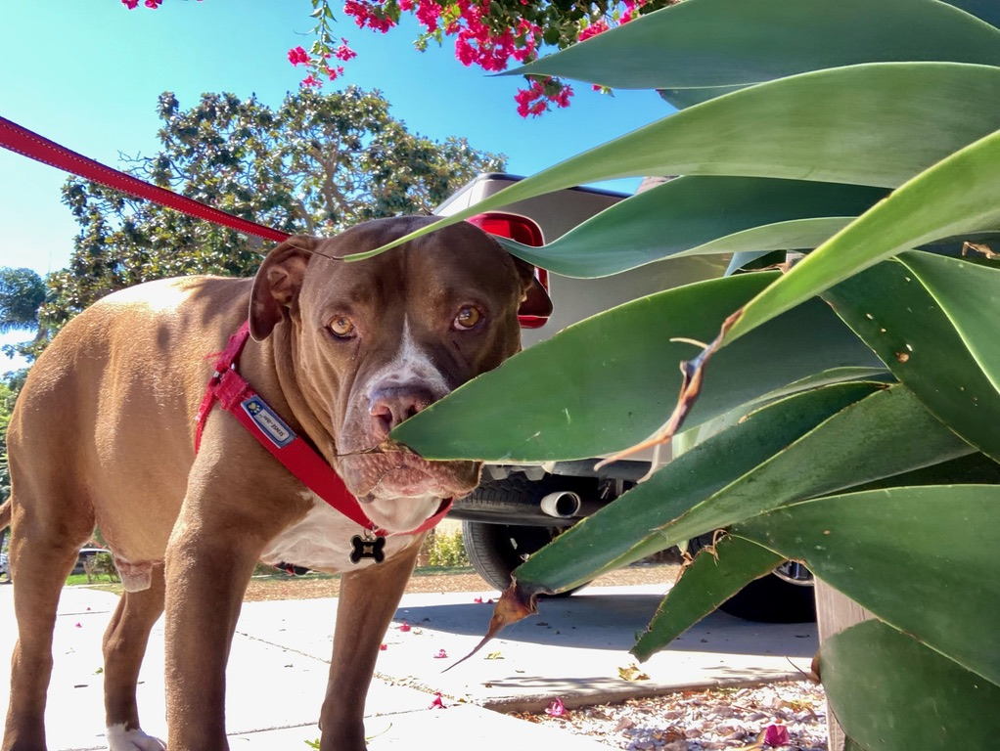

Hello! My name is Averi Giudicessi, I am a clinical psychology doctoral student living in the Boston area with my partner and dog Robbie (pictured below).  Follow along to see what projects I am working on in my doctoral program and beyond. 

{fig-alt="A brown and white dog standing outside behind a green plant in the sun" .preview-image}

I am currently in a busy second year of my doctoral program and hope to write more about my research and upcoming projects here more often. For now I will leave you with this incredible picture of my really cute dog enjoying the San Diego sun. 
